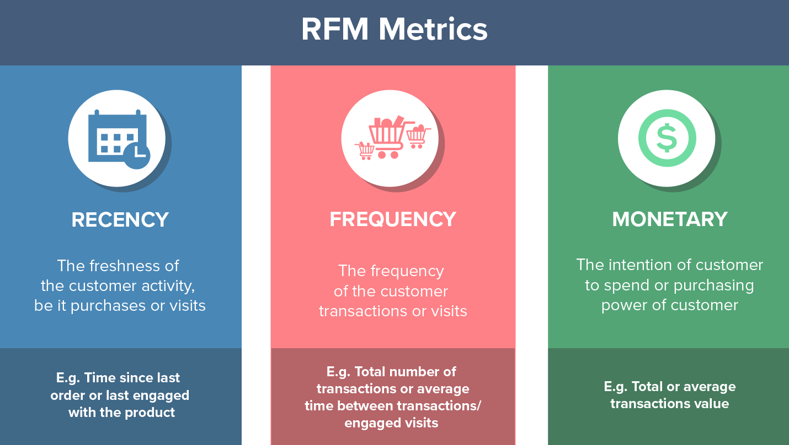

# Market Segmentation
Market segmentation adalah suatu metode untuk membagi suatu pasar menjadi kelompok-kelompok pembeli dengan karakteristik berbeda.

## RFM Analysis

RFM (Recency, Frequency, Monetary) adalah teknik pemasaran yang digunakan untuk menentukan secara kuantitatif pelanggan mana yang terbaik dengan memeriksa seberapa baru seorang pelanggan melakukan pembelian (recency), seberapa sering mereka melakukan pembelian (frequency), dan seberapa banyak uang yang dihabiskan oleh pelanggan tersebut (monetary). Dengan mempertimbangkan faktor-faktor ini, perusahaan dapat mengidentifikasi dan fokus pada pelanggan yang memiliki potensi tinggi untuk memberikan kontribusi signifikan terhadap keberhasilan bisnis.

## Studi Kasus
Gunakan datset yang diberikan pada tatutan di bawah ini yang berisi semua transaksi yang terjadi antara dd/mm/yyyy dan dd/mm/yyyy untuk tokok online di inggris dan juga non-store online retail. Perusahaan ini terutama menjual hadiah unik untuk segala kesempatan. Banyak pelanggan perusahaan adalah pedagang besar. 
- https://archive.ics.uci.edu/ml/datasets/Online+Retail

Hitung nilai RFM untuk setiap pelanggan berdasarkan id. Penjelasan tentang RFM dapat dilihat pada tautan berikut ini:
- https://en.wikipedia.org/wiki/RFM_(market_research) 

1. Untuk perhitungan Recency, gunakan 12/2011 sebagai bulan saat ini. Jadi, Recency seharusnya menunjukkan berapa bulan sebelumnya pelanggan tersebut melakukan pembelian dari tanggal saat ini. Jika melakukan pembelian pada bulan Desember, maka nilainya harus 0 dan seterusnya.
2. Frekuensi – Rata-rata seberapa sering setiap pelanggan melakukan pembelian dalam sebulan.
3. Nilai Moneter – Total pengeluaran oleh pelanggan dalam setahun.

## How to Solve?
1. Tentukan top 10 customers berdasarkan frequency dan monetary value. Urutkan berdasarkan frequency dan monetary value.
2. Identify optimal number of segments using dendogram dan elbow method.
3. Buat final segmentasi market dan label dari customer dan masuk kemana segment tersebut.
4. Explain secara intuitively

# Important Link

Link Colab:
https://colab.research.google.com/drive/1mKI2NKvsooW80v1affMVD4pLe_zf2Fmd?usp=sharing

Link Github:
https://github.com/Clayrisee/data-science-use-case/tree/main/market-segmentation

Resource Link:
https://mailchimp.com/resources/rfm-analysis/#:~:text=RFM%2C%20also%20known%20as%20RFM,monetary%20value%20of%20a%20transaction.
https://archive.ics.uci.edu/dataset/352/online+retail
https://www.kdnuggets.com/2023/03/3-ways-merge-pandas-dataframes.html
https://www.analyticsvidhya.com/blog/2021/01/in-depth-intuition-of-k-means-clustering-algorithm-in-machine-learning/